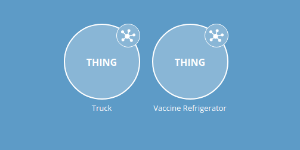
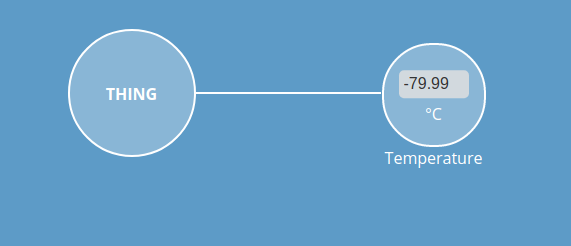
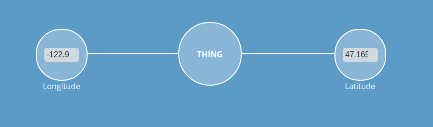

# WebThings Vaccine Distribution Simulator

[Akri Scenario: Distribution of Vaccines](https://docs.google.com/document/d/1zNWUzaTuvTPcHsH_GNlNh6p1XN2QDZF5sfcKuFTknjU/edit#heading=h.9m8u7fba07v)



Refrigerators (currently) have a temperature sensor:



Truck have latitude and longitude:



## mDNS|DNS-SD

WebThings devices are published as `_webthing._tcp` services.

## Gateway

```bash
docker run \
--rm \
--interactive --tty \
--name webthings-gateway \
--env=TZ=America/Los_Angeles \
--volume=${PWD}/webthings:/home/node/.webthings \
--network=host \
--log-opt max-size=1m \
--log-opt max-file=10 \
webthingsio/gateway:latest
```

## Run

```bash
cargo run
```

Then:

```bash
curl --silent http://localhost:8888/ \
| jq .
```

Yields:

```JSON
[
  {
    "@context": "https://iot.mozilla.org/schemas",
    "@type": [],
    "actions": {},
    "base": "http://localhost:8888/0",
    "description": "IIoT Vaccine Refrigerator",
    "events": {},
    "href": "/0",
    "id": "refrigerator",
    "links": [
      {
        "href": "/0/properties",
        "rel": "properties"
      },
      {
        "href": "/0/actions",
        "rel": "actions"
      },
      {
        "href": "/0/events",
        "rel": "events"
      },
      {
        "href": "ws://localhost:8888/0",
        "rel": "alternate"
      }
    ],
    "properties": {
      "temperature": {
        "@type": "TempProperty",
        "description": "Temperature of the Refrigerator",
        "links": [
          {
            "href": "/0/properties/temperature",
            "rel": "property"
          }
        ],
        "title": "Temperature",
        "type": "number"
      }
    },
    "security": "nosec_sc",
    "securityDefinitions": {
      "nosec_sc": {
        "scheme": "nosec"
      }
    },
    "title": "Vaccine Refrigerator"
  },
  {
    "@context": "https://iot.mozilla.org/schemas",
    "@type": [],
    "actions": {},
    "base": "http://localhost:8888/1",
    "description": "Truck",
    "events": {},
    "href": "/1",
    "id": "truck",
    "links": [
      {
        "href": "/1/properties",
        "rel": "properties"
      },
      {
        "href": "/1/actions",
        "rel": "actions"
      },
      {
        "href": "/1/events",
        "rel": "events"
      },
      {
        "href": "ws://localhost:8888/1",
        "rel": "alternate"
      }
    ],
    "properties": {
      "latitude": {
        "@type": "LatitudeProperty",
        "description": "Latitude of the Truck",
        "links": [
          {
            "href": "/1/properties/latitude",
            "rel": "property"
          }
        ],
        "title": "Latitude",
        "type": "number"
      },
      "longitude": {
        "@type": "LongitudeProperty",
        "description": "Longitude of the Truck",
        "links": [
          {
            "href": "/1/properties/longitude",
            "rel": "property"
          }
        ],
        "title": "Longitude",
        "type": "number"
      }
    },
    "security": "nosec_sc",
    "securityDefinitions": {
      "nosec_sc": {
        "scheme": "nosec"
      }
    },
    "title": "Truck"
  }
]
```


